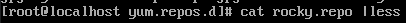
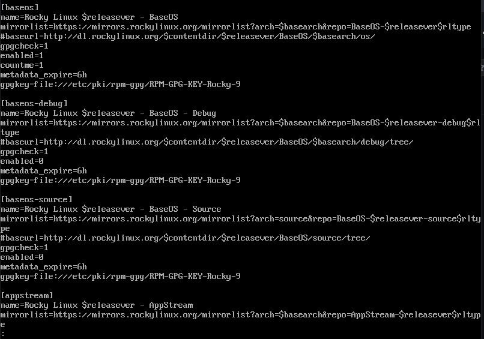

## ¿Donde se encuentra los repositorios?
Los repositorios en rocky linux se encuentran en la ruta de /etc/yum.repos.d/ y la mayoria de archivos que hay ahi son repositorios 

Por lo que se ve en los repositorios si no fijamos bien en algunas partes pone enable=0 esos significa que esta instalado o que hay alguno que existe en el sistema, mientras si pone que es enable=1 significa
